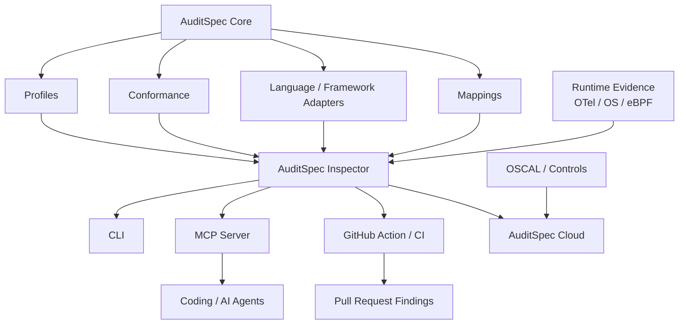
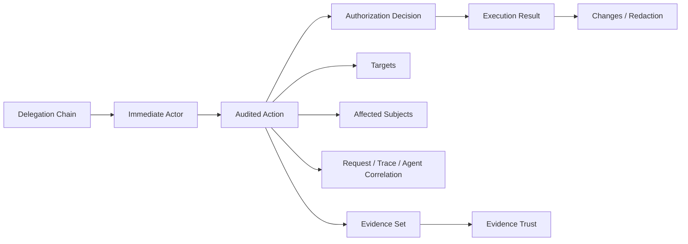
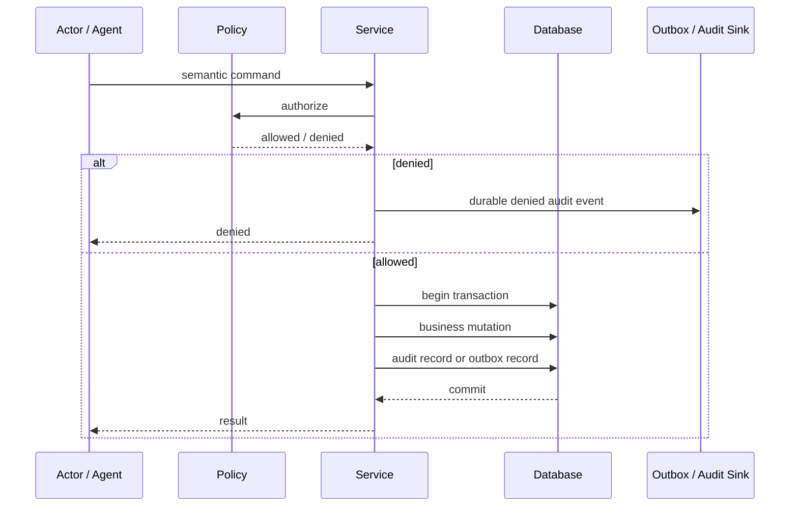
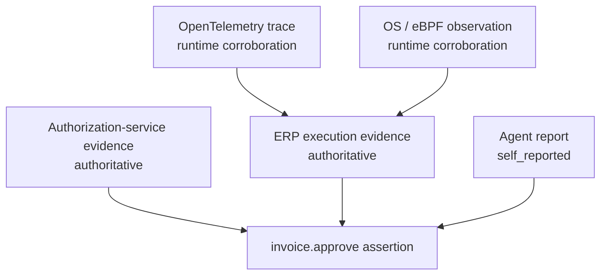
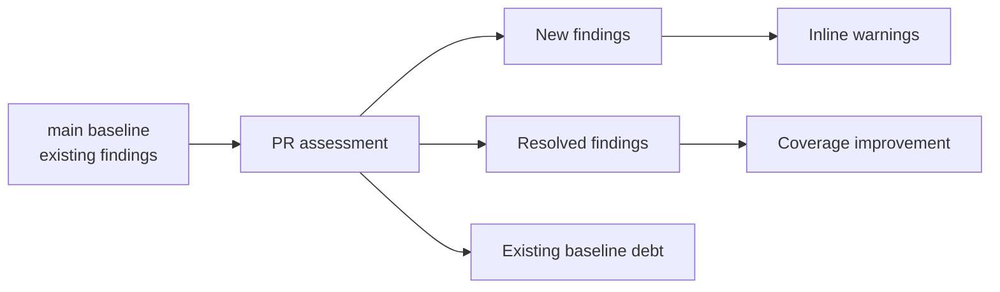

# AuditSpec architecture

AuditSpec is designed as a small semantic core surrounded by optional executable layers.

## Ecosystem layers



## Semantic event model



Authorization and execution result are deliberately separate. `allowed` does not imply `succeeded`.

## Mutation recording path



When mutation and audit storage share a transaction, both should commit or roll back together. When they cannot, a reliable outbox/reconciliation design is preferred over fire-and-forget delivery.

## Agent / MCP flow

```mermaid
sequenceDiagram
    participant U as User
    participant A as Agent
    participant M as MCP Tool
    participant S as Application Service
    participant DB as Database

    U->>A: goal / instruction
    A->>M: tool call
    M->>S: authenticated request
    S->>S: authorization decision
    S->>DB: business mutation + authoritative audit evidence
    DB-->>S: commit
    S-->>M: result
    M-->>A: tool result

    Note over A,S: Correlate session / turn / tool_call / trace / span
    Note over A,S: Agent report may be self-reported; service execution may be authoritative
```

## Evidence graph



A kernel observation may strongly corroborate that a process opened a connection or wrote data, but it does not automatically know that those bytes semantically represented `invoice.approve`.

## Continuous assurance loop


The same Inspector result should be consumable by CLI, CI, MCP, IDEs, GitHub Checks, and optional cloud services.

## GitHub ratchet model



The default PR experience should not repeat every historical problem. It should show total coverage while emphasizing regressions introduced by the current change and improvements that close old gaps.
