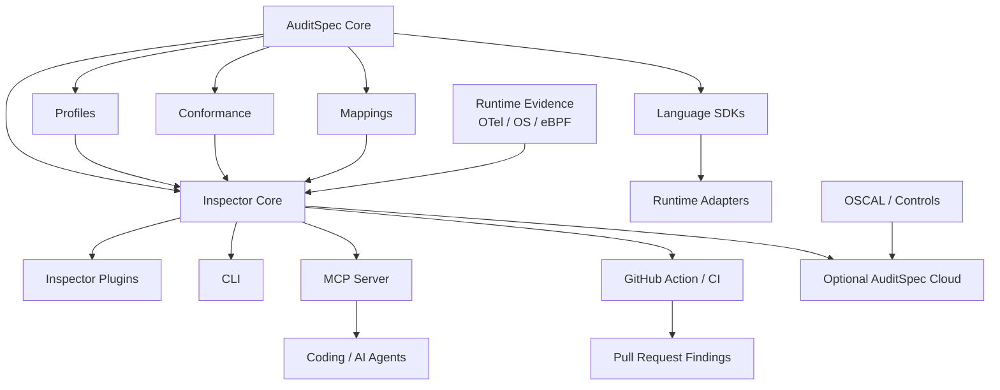
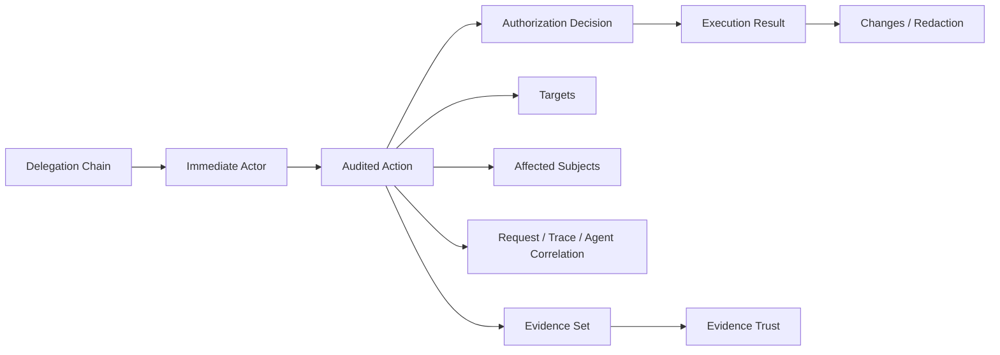
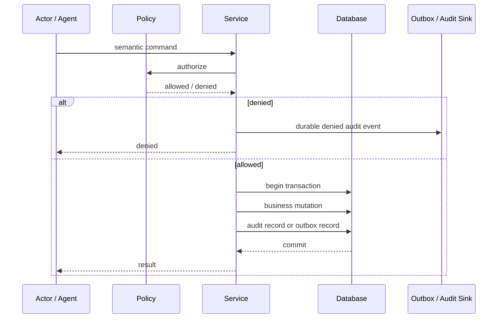
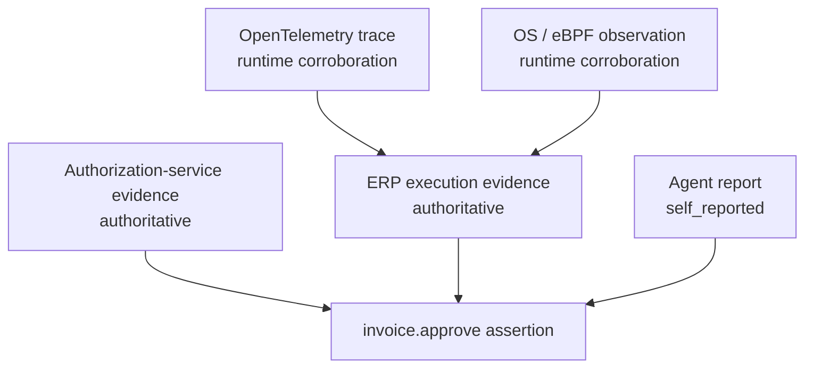
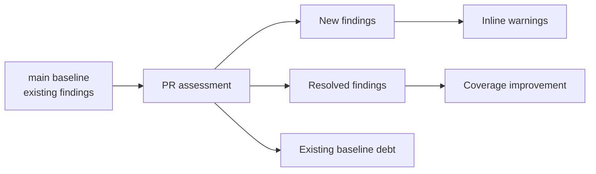

# AuditSpec architecture

AuditSpec is designed as a small semantic core surrounded by optional executable layers. Frameworks and languages are integrations with AuditSpec, not members of the Core semantic model.

## Extension dependency contract

```text
                         AuditSpec Core
              SPEC / schema / profiles / conformance
                               |
             +-----------------+-----------------+
             |                                   |
      language implementations                Inspector Core
   TypeScript / Ruby / Python / Go ...      assessment + graph model
             |                                   |
        runtime adapters                    Inspector plugins
      Rails / Frappe / ...               Rails / Frappe / ...
             |                                   |
             +---------------+-------------------+
                             |
                       behavioral labs
```

The arrows point from an integration toward the more stable contract it consumes. Core never points back toward a framework.

The permanent dependency rules are:

1. Core MUST NOT depend on a language SDK, runtime adapter, Inspector plugin, or behavioral lab.
2. A language SDK MAY depend on Core, but MUST remain framework-neutral.
3. A runtime adapter MAY depend on Core and a language SDK.
4. Inspector Core MUST NOT import Rails-, Frappe-, NestJS-, Next.js-, or other vendor-specific analysis semantics.
5. An Inspector plugin MAY depend on Inspector Core and framework-specific analysis helpers.
6. Runtime adapters and Inspector plugins are independent capabilities and MUST NOT be treated as proof of one another.
7. Labs MAY depend on adapters/framework runtimes, but bounded lab evidence MUST NOT become universal Core semantics.
8. Extension-facing framework identity MUST remain open; adding a new vendor must not require editing a closed Core enum.
9. Unsupported or ambiguous framework behavior must fail toward unresolved/unknown rather than optimistic assurance.

These rules are enforced in the TypeScript test suite for the current Inspector and Assurance Graph cores.

## Layer responsibilities

### AuditSpec Core

Core owns portable semantics and contracts: actor/delegation, actions, targets/subjects, authorization decision, result, changes, correlation, evidence/trust, ordering, redaction, logical identity, delivery/retry semantics, JSON Schemas, and shared conformance vectors.

A framework API change must not require a Core release merely because a router, callback, transaction, job, or hook API changed.

### Language implementations / SDKs

Language implementations execute the shared Core contracts. TypeScript, Ruby, and Python are current reference implementations.

A future **AuditSpec Go** belongs here. Go is a language implementation/SDK, not a framework adapter.

Language implementations reuse Core schemas and conformance data and must not create language-specific meanings for Core fields.

### Runtime adapters

Runtime framework integrations live under `adapters/`.

Current examples:

- `adapters/rails/`
- `adapters/frappe/`

A runtime adapter may understand ActiveRecord transactions, Frappe `after_commit`, framework job boundaries, and similar runtime details. It may depend on a language implementation and Core, but it must not redefine Core semantics.

`AuditSpec Rails` and `AuditSpec Frappe` can eventually be distributed/versioned independently even while development remains in this monorepo.

### Inspector Core

Inspector Core owns framework-neutral concepts such as Assessment Reports, findings/confidence, assurance roles, graph nodes/edges/paths, unresolved calls, conservative path evaluation, topology diff, remediation, and evidence queries.

The current TypeScript assessment engine consumes `InspectorFrameworkPlugin` instances. The current Assurance Graph engine consumes `AssuranceGraphPlugin` instances.

### Inspector framework plugins

Framework plugins translate concrete source/framework constructs into generic Inspector evidence.

Examples of plugin-owned knowledge:

- Rails routes, controller callbacks, jobs, and ActionCable dispatch;
- Frappe whitelist decorators, hooks, enqueue surfaces, and DocType lifecycle dispatch.

The default CLI composes built-in plugins at a composition root. A caller can use the public plugin APIs with another plugin set without modifying Inspector Core.

The Assurance Graph schema uses an open string for framework identity. A synthetic third-party `acme` plugin test protects the rule that a new framework can emit a schema-valid surface without being added to a vendor enum in Core.

### Source-language boundary

Framework extensibility and source-language extensibility are separate concerns.

The v0.2 Assurance Graph source scanner currently feeds Ruby and Python AST scopes into graph plugins. This is an explicit implementation limitation, not a conceptual restriction of AuditSpec. NestJS/Next.js TypeScript/JavaScript inspection and Go inspection require a separate source-language/scanner extension boundary rather than adding TypeScript/Go parsing assumptions to framework-neutral graph semantics.

### Runtime adapter vs Inspector plugin

For one framework, runtime integration and source inspection remain independent:

```text
adapters/frappe/
  transaction/persistence integration

Inspector Frappe plugin
  static source discovery and framework dispatch projection
```

Static inspection does not prove the runtime adapter is installed. Runtime adapter behavior does not prove every application path was statically discovered. Capability manifests keep these evidence layers separate.

### Behavioral labs

Labs validate bounded runtime claims against real or representative framework/storage behavior. Current examples include PostgreSQL, Rails/ActiveRecord, and pinned Frappe Bench + MariaDB proofs.

A lab result is evidence for the exact tested boundary, not a Core semantic rule or production certification.

## Repository extension layout

```text
spec/                         focused Core design notes
schema/                       machine-readable contracts
profiles/                     optional semantic/assurance profiles
conformance/                  shared interoperability vectors

implementations/
  typescript/                 language reference + current Inspector host
  ruby/                       language reference
  python/                     language reference
  go/                         future language reference

adapters/
  rails/                      runtime adapter
  frappe/                     runtime adapter

implementations/typescript/src/inspector/
  core.ts                     framework-neutral assessment engine
  plugin.ts                   assessment plugin contract
  assurance-graph/
    core.ts                   framework-neutral graph engine
    plugin.ts                 graph plugin contract
    default-plugins.ts        composition root
  plugins/
    rails*.ts                 Rails-specific projections
    frappe*.ts                Frappe-specific projections

runtime/producers/            runtime evidence producer profiles
lab/                          bounded behavioral proofs
```

The monorepo is a development convenience, not a semantic coupling requirement. These layers can later become separately versioned packages/repositories.

A future release model can therefore look like:

```text
AuditSpec Core            0.2
AuditSpec TypeScript SDK  0.3
AuditSpec Go SDK          0.1
AuditSpec Rails           0.4
AuditSpec Frappe          0.6
AuditSpec NestJS          0.1
```

A Frappe API change should normally produce a Frappe adapter/plugin release, not a Core semantic version bump.

## Ecosystem layers



## Semantic event model



Authorization and execution result are deliberately separate. `allowed` does not imply `succeeded`.

## Mutation recording path



When mutation and audit storage share a transaction, both should commit or roll back together. When they cannot, a reliable outbox/reconciliation design is preferred over fire-and-forget delivery.

## Agent / MCP flow

```mermaid
sequenceDiagram
    participant U as User
    participant A as Agent
    participant M as MCP Tool
    participant S as Application Service
    participant DB as Database

    U->>A: goal / instruction
    A->>M: tool call
    M->>S: authenticated request
    S->>S: authorization decision
    S->>DB: business mutation + authoritative audit evidence
    DB-->>S: commit
    S-->>M: result
    M-->>A: tool result

    Note over A,S: Correlate session / turn / tool_call / trace / span
    Note over A,S: Agent report may be self-reported; service execution may be authoritative
```

## Evidence graph



A kernel observation may strongly corroborate that a process opened a connection or wrote data, but it does not automatically know that those bytes semantically represented `invoice.approve`.

## Continuous assurance loop


The same Inspector result should be consumable by CLI, CI, MCP, IDEs, GitHub Checks, and optional cloud services.

## GitHub ratchet model



The default PR experience should not repeat every historical problem. It should show total coverage while emphasizing regressions introduced by the current change and improvements that close old gaps.
