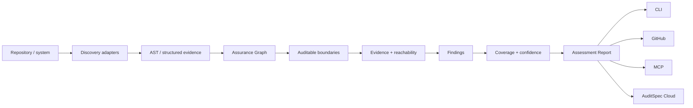

# AuditSpec Inspector

AuditSpec Inspector turns the specification into an assessment model for real systems.

The Inspector is not a compliance certifier and a finding is not automatically a vulnerability. Its job is to discover auditable boundaries, attach evidence, identify gaps, preserve uncertainty, model static reachability, and produce a stable machine-readable report that other surfaces can consume.

## Pipeline



## Assessment Report

`schema/assessment-report.schema.json` is the framework-neutral output contract. It contains subject, inspector/adapters, detected frameworks, boundaries, evidence, findings, confidence, audit coverage and reachability.

This separation matters because discovery quality will evolve. Tree-sitter AST, call graphs, framework dispatch, runtime, OTel and eBPF evidence can strengthen an assessment without changing Core Audit Event semantics.

## Boundaries

Initial boundary kinds are `mutation`, `authorization`, `agent`, `tool`, `export`, and `access`. A boundary is classified as `covered`, `partial`, `uncovered`, or `unknown` for audit coverage.

`unknown` is first-class. An analyzer MUST prefer uncertainty over pretending that a dynamic or cross-service path has been proven.

## Reachability

Audit coverage and reachability are separate dimensions.

A boundary is `reachable` only when the Assurance Graph can trace it to a known entrypoint through resolved source/framework edges. Otherwise reachability is `unknown`, not `unreachable`.

A reachable boundary records:

- confidence;
- the resolved entrypoint kind and qualified name;
- framework attribution when known;
- the selected path of qualified scopes/surfaces.

Current entrypoint evidence can include explicit Rails routes, controller fallbacks, ActiveJob/Sidekiq workers, Frappe whitelisted methods, `doc_events`, `scheduler_events`, and background enqueue targets.

Reachability is static evidence. It does not prove that a path executed in production. Future runtime evidence may corroborate or contradict it.

## AST-assisted adapters

The v0.1 Rails and Frappe adapters use ast-grep/Tree-sitter to locate actual call AST nodes. Mutation-looking text inside comments or string literals is therefore not treated as an executable call.

Calls are attached to their owning method/function scopes. The Assurance Graph then connects unambiguous cross-file calls and supported framework dispatch surfaces. Ambiguous calls remain unresolved and MUST NOT strengthen coverage.

Current adapters:

- `rails-ast-assisted-v0.1`
- `frappe-ast-assisted-v0.1`
- `assurance-call-graph-v0.1`

If a source file cannot be parsed, the adapter records an `ast_parse_failures` count in assessment metadata rather than silently turning a parse failure into certain evidence.

## Real-world regression smoke

CI runs the Inspector against pinned public revisions rather than copying third-party code into this repository:

- `lobsters/lobsters@2f385d149e67f5ff78643dcf6d3cab0b24c0117c` for Rails
- `frappe/wiki@2e4e4f215368387c08553c3c59723c7a2e1bf306` for Frappe

The smoke contract verifies framework detection, adapter activation, at least one discovered boundary, and a parseable Assessment Report. It deliberately does not snapshot exact finding counts because the goal is implementation regression detection, not declaring those projects audit-compliant or deficient.

## Findings

A finding includes stable rule/fingerprint, severity, confidence, location, evidence and remediation. Initial rules are documented in `findings/RULES.md`.

## Coverage

`audit_coverage` is the fraction of detected boundaries classified as fully covered by active adapters. It is only as complete as discovery and MUST NOT be presented as a compliance percentage or proof that all application behavior has been observed.

Reachability summary is reported separately as `reachable_boundaries` and `unknown_boundaries`. It MUST NOT be folded into a compliance score without an explicit external policy model.

## CLI

```bash
auditspec inspect .
auditspec inspect . --json
```

Human output includes audit coverage and statically reachable boundary counts. JSON Assessment Report is the canonical integration surface for GitHub, MCP and future Cloud.

## GitHub ratchet

PR integration compares base/head assessments using stable finding fingerprints. Existing debt stays in summary while inline warnings focus on new gaps. Stricter regression/enforcement policy is an opt-in layer, not a Core semantic.
