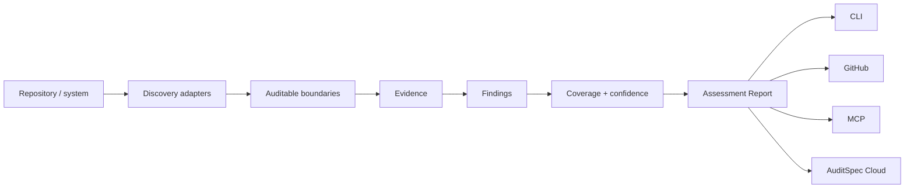

# AuditSpec Inspector

AuditSpec Inspector turns the specification into an assessment model for real systems.

The Inspector is not a compliance certifier and a finding is not automatically a vulnerability. Its job is to discover auditable boundaries, attach evidence, identify gaps, preserve uncertainty, and produce a stable machine-readable report that other surfaces can consume.

## Pipeline



## Assessment Report

`schema/assessment-report.schema.json` is the framework-neutral output contract.

A report contains:

- assessment subject
- inspector identity and adapter versions
- detected frameworks
- discovered boundaries
- evidence for each boundary/finding
- findings with stable rule IDs
- confidence
- coverage counts

This separation matters because discovery quality will evolve. A future Tree-sitter, language-server, call-graph, runtime, or eBPF adapter can provide stronger evidence without changing the report format.

## Boundaries

A boundary is a location where an accountable action may need audit semantics. Initial kinds are:

- `mutation`
- `authorization`
- `agent`
- `tool`
- `export`
- `access`

A boundary is classified as `covered`, `partial`, `uncovered`, or `unknown`.

`unknown` is first-class. An analyzer MUST prefer uncertainty over pretending that a dynamic or cross-service path has been proven.

## Findings

A finding includes:

- stable `rule_id`
- severity
- confidence
- source location
- evidence
- related boundary
- remediation summary

Initial rules are documented in `findings/RULES.md`.

## Coverage

`audit_coverage` currently means the fraction of detected boundaries classified as fully `covered` by the active adapter. Partial boundaries are reported separately rather than being assigned an arbitrary fractional score.

Coverage is only as complete as discovery. It MUST NOT be presented as a compliance percentage or proof that all application behavior has been observed.

## Initial Rails adapter

`rails-heuristic-v0.1` performs a deliberately small static scan:

1. Detect Rails from repository evidence.
2. Find common Active Record mutation calls.
3. Check the same file for AuditSpec emission markers.
4. Check for visible transaction markers.
5. Check privileged-looking mutations for visible authorization markers.
6. Emit boundaries and advisory findings with explicit confidence.

This first adapter is useful for bootstrapping and tests, but it does not build a Ruby call graph and cannot prove cross-file absence.

## CLI

```bash
auditspec inspect .
auditspec inspect . --json
```

Human output is intended for local development. JSON output is the canonical integration surface.

## GitHub ratchet direction

The future GitHub integration should compare the assessment of the base revision with the pull request revision:

```text
base findings + coverage
        |
        v
      diff
        |
        +--> new findings
        +--> resolved findings
        +--> changed confidence / coverage
```

Default behavior should be advisory. Existing debt remains visible in summary, while inline warnings focus on **new gaps introduced by the pull request**.

A stricter project may later opt into regression or enforcement policies without changing AuditSpec Core.
