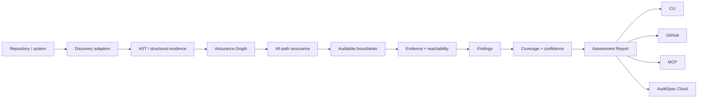

# AuditSpec Inspector

AuditSpec Inspector turns the specification into an assessment model for real systems.

The Inspector is not a compliance certifier and a finding is not automatically a vulnerability. Its job is to discover auditable boundaries, attach evidence, identify gaps, preserve uncertainty, model static reachability, evaluate alternate entrypoint paths, and produce a stable machine-readable report that other surfaces can consume.

## Pipeline



The reference implementation keeps discovery and assurance evaluation separate. `inspect.ts` performs framework/AST discovery and best-path reconciliation. `inspector.ts` is the canonical public composition layer: it combines the base assessment with an Assurance Graph and applies all-path hardening before returning the final report.

## Assessment Report

`schema/assessment-report.schema.json` is the framework-neutral output contract. It contains subject, inspector/adapters, detected frameworks, boundaries, evidence, findings, confidence, audit coverage and reachability.

Every boundary has a stable fingerprint and an explicit reachability state. This makes Assessment Reports suitable for base/head ratchets without treating line movement as a new boundary.

## Boundaries

Initial boundary kinds are `mutation`, `authorization`, `agent`, `tool`, `export`, and `access`. A boundary is classified as `covered`, `partial`, `uncovered`, or `unknown` for audit coverage.

`unknown` is first-class. An analyzer MUST prefer uncertainty over pretending that a dynamic, truncated, or cross-service path has been proven.

## Reachability

Audit coverage and reachability are separate dimensions.

A boundary is `reachable` only when the Assurance Graph can trace it to a known entrypoint through resolved source/framework edges. Otherwise reachability is `unknown`, not `unreachable`.

A reachable boundary records confidence, the resolved entrypoint, framework attribution when known, and a representative path of qualified scopes/surfaces.

Current entrypoint evidence can include context-aware explicit Rails routes, conservative literal Rails `resources`/`resource` routes including supported namespace/nesting/`scope` composition and literal constraint metadata, controller fallbacks, ActiveJob/Sidekiq workers, conservative ActionCable channel actions/lifecycle callbacks and conventional connection lifecycle callbacks, Frappe whitelisted methods, `doc_events`, `scheduler_events`, and background enqueue targets.

Reachability is static evidence. It does not prove that a path executed in production. Runtime Corroboration can independently support, contradict, or remain inconclusive about static observations without rewriting the static Assessment Report.

### Rails route DSL boundary

The v0.1 Rails route resolver expands only routing declarations whose dispatch can be determined conservatively from source.

Supported routing includes:

- explicit `get`, `post`, `put`, `patch`, and `delete` routes with a literal controller/action target;
- `resources` and singular `resource`;
- literal `only` and `except` action filters;
- literal `path`, `param`, and `controller` resource options;
- literal `namespace :name do ... end` blocks;
- nested `resources`/`resource` blocks, including parent member parameters;
- literal `scope` blocks with a positional path and/or literal `path`, `module`, and `as` options;
- combinations of supported namespaces, scopes, and nested resource declarations;
- literal `constraints ... do` blocks whose constraint hash uses simple scalar string, symbol, numeric, or boolean values.

Routing context is applied to both resource expansion and explicit routes. For example, an explicit route under `scope '/v1', module: :api` resolves to the scoped path and `Api::*Controller` target rather than also producing an optimistic root-route edge.

Static route constraints are preserved in the canonical framework-surface detail and therefore participate in stable topology identity. A constraint is only a condition on when an entrypoint matches. It MUST NOT be treated as authorization evidence and MUST NOT be used to claim that a route is unreachable.

Unsupported or dynamic routing constructs do not produce optimistic framework edges. Examples include dynamic scope path/module values, callable or object-backed constraints, complex constraint expressions outside the literal scalar subset, conditional route declarations, and resource options whose semantics are not modeled. Per-resource `constraints:` options remain outside this v0.1 subset.

### Rails callback authorization boundary

The v0.1 Rails adapter can project authorization evidence from a conservative subset of controller `before_action` callbacks onto a routed controller action.

Supported callback evidence requires:

- a literal `before_action :method` callback;
- optionally multiple literal callback methods;
- optional literal `only` and `except` filters using symbols, symbol arrays, or `%i[...]`;
- a resolved callback method whose body contains authorization semantics already recognized by the deterministic Ruby adapter, such as `authorize`, `policy_scope`, `allowed_to?`, or `can?`;
- either a callback in the routed controller itself or an unambiguous literal superclass chain such as `InvoicesController < SecuredController < ApplicationController`;
- explicit fully-qualified namespaced superclass chains such as `Admin::InvoicesController < Admin::BaseController` when each namespaced class declaration and superclass reference can be matched exactly;
- or a literal concern include on a supported controller in that chain, where the module is uniquely resolved, uses `extend ActiveSupport::Concern`, has a single literal `included do ... end` block, and defines the referenced authorization callback method itself;
- explicit fully-qualified concern identities such as `include Admin::AuthorizationConcern` paired with `module Admin::AuthorizationConcern` are supported when they resolve uniquely.

Only the `authorization` assurance role is projected onto the routed action. Audit or transaction roles are not projected from callbacks because observing those operations inside a callback does not prove that the later business mutation shares the same audit or transactional semantics.

Conditional callbacks such as `if:` or `unless:`, dynamic callback names, dynamic concern inclusion, non-`ActiveSupport::Concern` modules, malformed or ambiguous concern sources, ambiguous superclass sources, files containing `skip_before_action`, and namespace semantics that require Ruby lexical constant lookup do not produce positive callback authorization evidence. The resolver fails closed rather than assuming that a callback applies.

In particular, lexical nesting such as `module Admin; class InvoicesController ... end; end` or nested concern declarations is not treated as equivalent to an explicit fully-qualified declaration in this v0.1 proof model.

Lexical/nested concern composition, concern dependencies, more complex route constraints, and additional framework-generated dispatch remain outside the current v0.1 resolver.

### Rails ActionCable boundary

ActionCable is modeled as framework dispatch because Rails exposes channel behavior as RPC-style client-callable methods and connection/subscription lifecycle callbacks rather than only REST routes.

The v0.1 resolver creates separate high-confidence framework surfaces for:

- direct public channel methods, represented as `rails_action_cable_action`;
- a directly defined `subscribed` lifecycle callback, represented as `rails_action_cable_subscribe`;
- a directly defined `unsubscribed` lifecycle callback, represented as `rails_action_cable_unsubscribe`;
- the conventional `ApplicationCable::Connection#connect` lifecycle callback, represented as `rails_action_cable_connect`;
- the conventional `ApplicationCable::Connection#disconnect` lifecycle callback, represented as `rails_action_cable_disconnect`.

Positive channel evidence requires an `app/channels/**/*.rb` method belonging to an explicitly declared channel class that directly inherits from `ApplicationCable::Channel` or `ActionCable::Channel::Base`. Explicit fully-qualified class identities such as `class Admin::ChatChannel < ApplicationCable::Channel` are supported.

Connection lifecycle evidence is intentionally narrower. The resolver supports the conventional `ApplicationCable::Connection` identity when it directly inherits from `ActionCable::Connection::Base`, including both `class ApplicationCable::Connection < ...` and the Rails-generated lexical form `module ApplicationCable; class Connection < ...`. Custom connection-class configuration and indirect connection inheritance do not produce optimistic lifecycle edges.

RPC action exposure is conservative about Ruby visibility. Direct channel methods proven to be under class-level `private` or `protected` visibility, including explicit non-public symbol declarations, are not exposed as ActionCable action surfaces. Known ActionCable internal methods are not treated as client actions. `subscribed` and `unsubscribed` are modeled only as lifecycle dispatch, not as RPC actions.

Indirect channel inheritance, lexical namespace resolution such as `module Admin; class ChatChannel ...`, inherited or concern-provided channel actions, dynamic visibility/metaprogramming, custom connection-class wiring, and runtime channel registration behavior are not currently used to strengthen static assurance.

Authorization found in `connect` or `subscribed` is deliberately not projected onto later client-callable actions. Connection/subscription authorization may in practice guard later channel access, but proving that stateful guarantee for every later action requires a stronger framework/runtime model. The static graph therefore keeps `CONNECT -> ApplicationCable::Connection#connect`, `SUBSCRIBE -> Channel#subscribed`, and `ACTION -> Channel#method` as distinct paths.

## All-path assurance

A single best path is insufficient for assurance. If the same privileged mutation can be reached through two entrypoints, an authorized path MUST NOT hide an alternate path that bypasses authorization.

The canonical v0.1 Inspector therefore enumerates resolved paths from known entrypoints to each mutation boundary and evaluates assurance roles across the entire path set.

Examples:

```text
authorized route -> controller[authorization] -> service -> mutation
bypass route     -> controller                -> service -> mutation
```

produces `AS-AUTH-002` even though one path contains authorization evidence.

Similarly:

- `AS-AUDIT-002` identifies mixed path sets where some reachable paths contain semantic audit evidence and others do not;
- `AS-ATOMIC-002` identifies fully audited Rails path sets with inconsistent transaction evidence;
- the boundary's audit status is based on the path set, not the strongest individual path.

The reference enumerator caps analysis at 64 paths per boundary and depth 8 to avoid combinatorial explosion. If the cap is hit, the Inspector MUST NOT claim full coverage. The boundary is downgraded to `unknown` with low confidence and the truncation is recorded in metadata.

The canonical adapter list includes `assurance-all-path-v0.1` when this post-pass runs.

## AST-assisted adapters

The v0.1 Rails and Frappe adapters use ast-grep/Tree-sitter to locate actual call AST nodes. Mutation-looking text inside comments or string literals is therefore not treated as an executable call.

Calls are attached to their owning method/function scopes. The Assurance Graph connects unambiguous cross-file calls and supported framework dispatch surfaces. Ambiguous calls remain unresolved and MUST NOT strengthen coverage.

Current reference adapters include:

- `rails-ast-assisted-v0.1`
- `frappe-ast-assisted-v0.1`
- `assurance-call-graph-v0.1`
- `assurance-all-path-v0.1`

If a source file cannot be parsed, the adapter records an `ast_parse_failures` count in assessment metadata rather than silently turning a parse failure into certain evidence.

## Real-world regression smoke

CI runs the Inspector against pinned public revisions rather than copying third-party code into this repository:

- `lobsters/lobsters@2f385d149e67f5ff78643dcf6d3cab0b24c0117c` for Rails
- `frappe/wiki@2e4e4f215368387c08553c3c59723c7a2e1bf306` for Frappe

The smoke contract verifies framework detection, adapter activation, at least one discovered boundary, and a parseable Assessment Report. It deliberately does not snapshot exact finding counts because the goal is implementation regression detection, not declaring those projects audit-compliant or deficient.

Synthetic regression tests additionally cover explicit route exposure, namespaced/nested/scoped resource dispatch, context-aware scoped explicit routes, static constraint surface identity, local/inherited/concern-derived/explicit-namespaced callback authorization, ActionCable public/channel lifecycle dispatch, conventional connection `connect`/`disconnect` dispatch, non-public channel exclusion, namespaced channel identities, and connection/subscription authorization separation from later actions.

## Findings

A finding includes stable rule/fingerprint, severity, confidence, location, evidence and remediation. Stable v0.1 rules are documented in `findings/RULES.md`.

## Coverage

`audit_coverage` is the fraction of detected boundaries classified as fully covered by active adapters. It is only as complete as discovery and MUST NOT be presented as a compliance percentage or proof that all application behavior has been observed.

Reachability summary is reported separately as `reachable_boundaries` and `unknown_boundaries`. It MUST NOT be folded into a compliance score without an explicit external policy model.

## CLI

```bash
auditspec inspect .
auditspec inspect . --json
```

Human output includes audit coverage and statically reachable boundary counts. JSON Assessment Report is the canonical integration surface for GitHub, MCP and future Cloud.

## GitHub ratchet

PR integration compares base/head assessments using stable finding and boundary fingerprints, and separately compares Assurance Graph topology. Existing debt stays in summary while new findings and newly exposed uncovered boundaries become advisory warnings.

A pull request that adds an unauthorized alternate route or ActionCable action to an existing privileged mutation can therefore produce a new path-level assurance gap even when the mutation source itself is unchanged.
