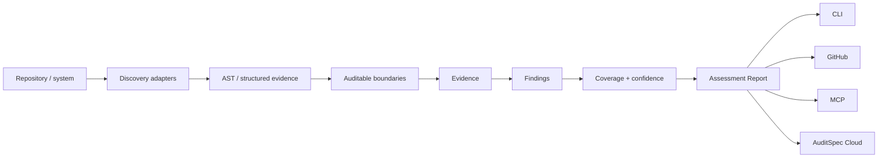

# AuditSpec Inspector

AuditSpec Inspector turns the specification into an assessment model for real systems.

The Inspector is not a compliance certifier and a finding is not automatically a vulnerability. Its job is to discover auditable boundaries, attach evidence, identify gaps, preserve uncertainty, and produce a stable machine-readable report that other surfaces can consume.

## Pipeline



## Assessment Report

`schema/assessment-report.schema.json` is the framework-neutral output contract. It contains subject, inspector/adapters, detected frameworks, boundaries, evidence, findings, confidence and coverage.

This separation matters because discovery quality will evolve. Tree-sitter AST, call graphs, runtime, OTel and eBPF evidence can strengthen an assessment without changing its report format or stable finding fingerprints.

## Boundaries

Initial boundary kinds are `mutation`, `authorization`, `agent`, `tool`, `export`, and `access`. A boundary is classified as `covered`, `partial`, `uncovered`, or `unknown`.

`unknown` is first-class. An analyzer MUST prefer uncertainty over pretending that a dynamic or cross-service path has been proven.

## AST-assisted adapters

The v0.1 Rails and Frappe adapters use ast-grep/Tree-sitter to locate actual call AST nodes. This removes a major source of regex-only false positives: mutation-looking text inside comments or string literals is not treated as an executable call.

AST evidence raises confidence that a call exists at a source location, but it still does not prove runtime reachability, cross-file authorization, dynamic dispatch, transaction propagation, or that every mutation surface has been discovered. Those require stronger call-graph/runtime evidence.

Current adapters:

- `rails-ast-assisted-v0.1`
- `frappe-ast-assisted-v0.1`

If a source file cannot be parsed, the adapter records an `ast_parse_failures` count in assessment metadata rather than silently downgrading the parse failure into certain evidence.

## Findings

A finding includes stable rule/fingerprint, severity, confidence, location, evidence and remediation. Initial rules are documented in `findings/RULES.md`.

## Coverage

`audit_coverage` is the fraction of detected boundaries classified as fully covered by active adapters. It is only as complete as discovery and MUST NOT be presented as a compliance percentage or proof that all application behavior has been observed.

## CLI

```bash
auditspec inspect .
auditspec inspect . --json
```

Human output is for local development. JSON Assessment Report is the canonical integration surface for GitHub, MCP and future Cloud.

## GitHub ratchet

PR integration compares base/head assessments using stable finding fingerprints. Existing debt stays in summary while inline warnings focus on new gaps. Stricter regression/enforcement policy is an opt-in layer, not a Core semantic.
