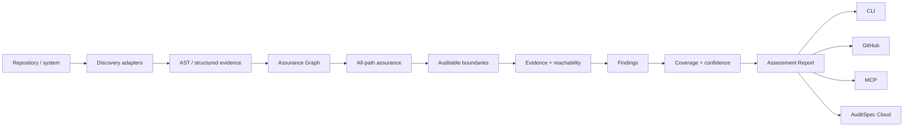

# AuditSpec Inspector

AuditSpec Inspector turns the specification into an assessment model for real systems.

The Inspector is not a compliance certifier and a finding is not automatically a vulnerability. Its job is to discover auditable boundaries, attach evidence, identify gaps, preserve uncertainty, model static reachability, evaluate alternate entrypoint paths, and produce a stable machine-readable report that other surfaces can consume.

## Pipeline



The reference implementation keeps discovery and assurance evaluation separate. `inspect.ts` performs framework/AST discovery and best-path reconciliation. `inspector.ts` is the canonical public composition layer: it combines the base assessment with an Assurance Graph and applies all-path hardening before returning the final report.

## Assessment Report

`schema/assessment-report.schema.json` is the framework-neutral output contract. It contains subject, inspector/adapters, detected frameworks, boundaries, evidence, findings, confidence, audit coverage and reachability.

Every boundary has a stable fingerprint and an explicit reachability state. This makes Assessment Reports suitable for base/head ratchets without treating line movement as a new boundary.

## Boundaries

Initial boundary kinds are `mutation`, `authorization`, `agent`, `tool`, `export`, and `access`. A boundary is classified as `covered`, `partial`, `uncovered`, or `unknown` for audit coverage.

`unknown` is first-class. An analyzer MUST prefer uncertainty over pretending that a dynamic, truncated, or cross-service path has been proven.

## Reachability

Audit coverage and reachability are separate dimensions.

A boundary is `reachable` only when the Assurance Graph can trace it to a known entrypoint through resolved source/framework edges. Otherwise reachability is `unknown`, not `unreachable`.

A reachable boundary records confidence, the resolved entrypoint, framework attribution when known, and a representative path of qualified scopes/surfaces.

Current entrypoint evidence can include explicit Rails routes, controller fallbacks, ActiveJob/Sidekiq workers, Frappe whitelisted methods, `doc_events`, `scheduler_events`, and background enqueue targets.

Reachability is static evidence. It does not prove that a path executed in production. Future runtime evidence may corroborate or contradict it.

## All-path assurance

A single best path is insufficient for assurance. If the same privileged mutation can be reached through two entrypoints, an authorized path MUST NOT hide an alternate path that bypasses authorization.

The canonical v0.1 Inspector therefore enumerates resolved paths from known entrypoints to each mutation boundary and evaluates assurance roles across the entire path set.

Examples:

```text
authorized route -> controller[authorization] -> service -> mutation
bypass route     -> controller                -> service -> mutation
```

produces `AS-AUTH-002` even though one path contains authorization evidence.

Similarly:

- `AS-AUDIT-002` identifies mixed path sets where some reachable paths contain semantic audit evidence and others do not;
- `AS-ATOMIC-002` identifies fully audited Rails path sets with inconsistent transaction evidence;
- the boundary's audit status is based on the path set, not the strongest individual path.

The reference enumerator caps analysis at 64 paths per boundary and depth 8 to avoid combinatorial explosion. If the cap is hit, the Inspector MUST NOT claim full coverage. The boundary is downgraded to `unknown` with low confidence and the truncation is recorded in metadata.

The canonical adapter list includes `assurance-all-path-v0.1` when this post-pass runs.

## AST-assisted adapters

The v0.1 Rails and Frappe adapters use ast-grep/Tree-sitter to locate actual call AST nodes. Mutation-looking text inside comments or string literals is therefore not treated as an executable call.

Calls are attached to their owning method/function scopes. The Assurance Graph connects unambiguous cross-file calls and supported framework dispatch surfaces. Ambiguous calls remain unresolved and MUST NOT strengthen coverage.

Current reference adapters include:

- `rails-ast-assisted-v0.1`
- `frappe-ast-assisted-v0.1`
- `assurance-call-graph-v0.1`
- `assurance-all-path-v0.1`

If a source file cannot be parsed, the adapter records an `ast_parse_failures` count in assessment metadata rather than silently turning a parse failure into certain evidence.

## Real-world regression smoke

CI runs the Inspector against pinned public revisions rather than copying third-party code into this repository:

- `lobsters/lobsters@2f385d149e67f5ff78643dcf6d3cab0b24c0117c` for Rails
- `frappe/wiki@2e4e4f215368387c08553c3c59723c7a2e1bf306` for Frappe

The smoke contract verifies framework detection, adapter activation, at least one discovered boundary, and a parseable Assessment Report. It deliberately does not snapshot exact finding counts because the goal is implementation regression detection, not declaring those projects audit-compliant or deficient.

Synthetic regression tests additionally cover route exposure, topology change, and an authorized-path-plus-bypass-path scenario.

## Findings

A finding includes stable rule/fingerprint, severity, confidence, location, evidence and remediation. Stable v0.1 rules are documented in `findings/RULES.md`.

## Coverage

`audit_coverage` is the fraction of detected boundaries classified as fully covered by active adapters. It is only as complete as discovery and MUST NOT be presented as a compliance percentage or proof that all application behavior has been observed.

Reachability summary is reported separately as `reachable_boundaries` and `unknown_boundaries`. It MUST NOT be folded into a compliance score without an explicit external policy model.

## CLI

```bash
auditspec inspect .
auditspec inspect . --json
```

Human output includes audit coverage and statically reachable boundary counts. JSON Assessment Report is the canonical integration surface for GitHub, MCP and future Cloud.

## GitHub ratchet

PR integration compares base/head assessments using stable finding and boundary fingerprints, and separately compares Assurance Graph topology. Existing debt stays in summary while new findings and newly exposed uncovered boundaries become advisory warnings.

A pull request that adds an unauthorized alternate route to an existing privileged mutation can therefore produce a new `AS-AUTH-002` even when the mutation source itself is unchanged.
